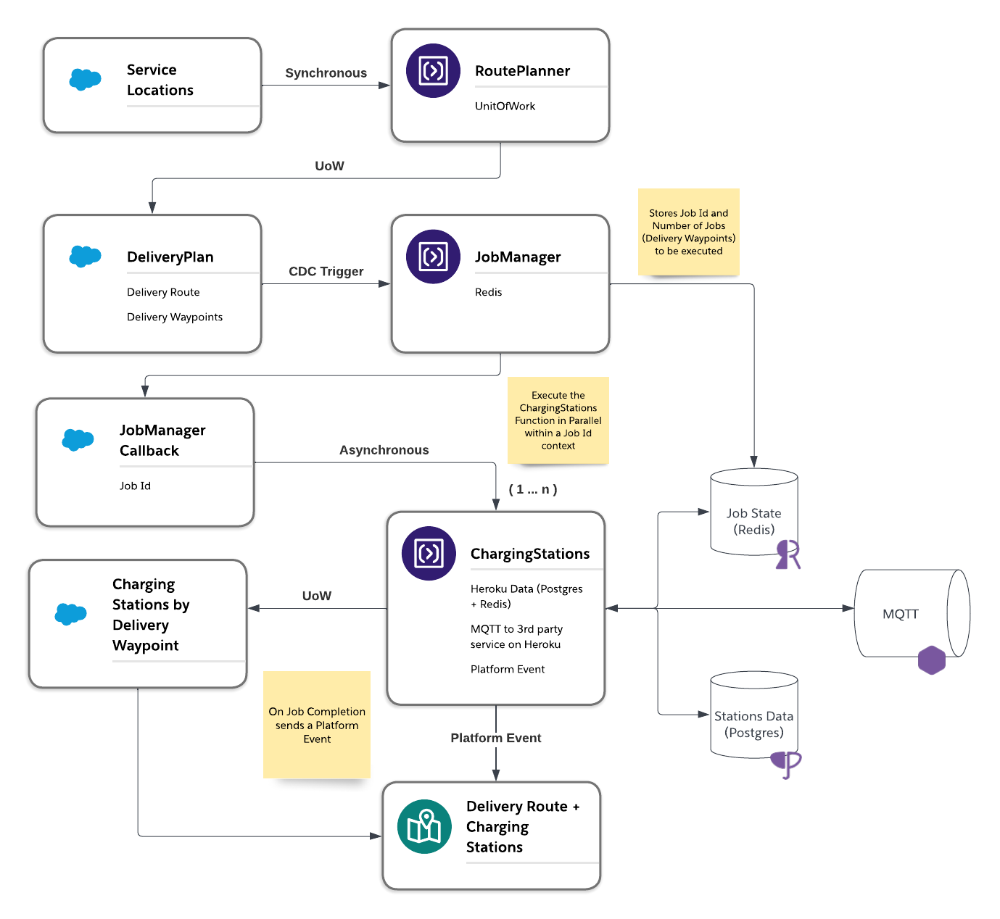
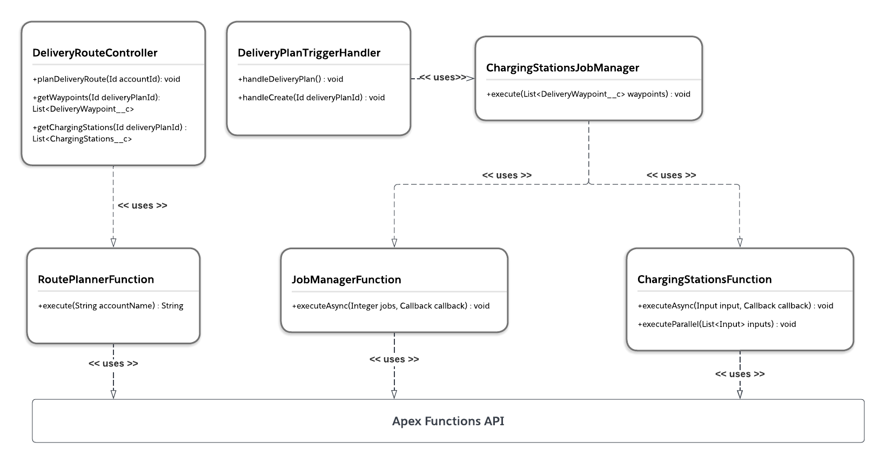
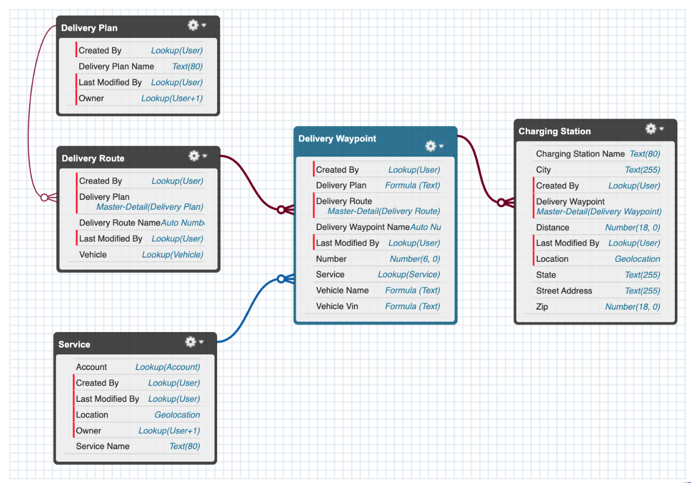

# Route Planner with Charging Stations

## Architecture



## Apex Utility Classes



## Salesforce Schema



## Deployment Instructions

1. Create a Scratch Org

```
sfdx force:org:create -s -f config/project-scratch-def.json -a routeplannerdemo
```

2. Push Source to Org

```
sfdx force:source:push -f
```

3. Assign Permission Sets

```
sfdx force:user:permset:assign -n RoutePlanner
sfdx force:user:permset:assign -n Functions
```

4. Import Sample Data

```
sfdx force:data:tree:import -p data/Account-Service__c-plan.json
```

5. Create a Compute Environment to Deploy Functions

```
sf env create compute -o routeplannerdemo -a routeplannerenv
```

6. Deploy Functions

```
sf deploy functions -o routeplannerdemo
```

7. Create Heroku Application for Data Resources

```
heroku create <app-name>
```

8. Add Heroku User Collaborator to Functions Account

```
sf env compute collaborator add --heroku-user username@example.com
```

9. Create Postgres and Redis Resources

```
 heroku addons:create heroku-postgresql:hobby-dev
 heroku addons:create heroku-redis:hobby-dev
```

10. Attach Data Resources to Compute Environment

```
heroku addons:attach <example-postgres-database> --app <example-compute-environment-name>
heroku addons:attach <example-redis-database> --app <example-compute-environment-name>
```

11. Deploy MQTT Heroku App

Setup [Monorepo](https://elements.heroku.com/buildpacks/lstoll/heroku-buildpack-monorepo) and Node.js Buildpacks:

```
heroku buildpacks:add https://github.com/lstoll/heroku-buildpack-monorepo -a <app-name>
heroku buildpacks:add heroku/nodejs -a <app-name>
```

Deploy Application using the Monorepo buildpack

```
heroku config:set APP_BASE=apps/pulsar-mqtt-broker
git push https://git.heroku.com/<heroku-app-name>.git main
```

12. Setup `MQTT_URL` env variable

```
sf env var set MQTT_URL=wss://<heroku-app-name>.herokuapp.com
```

13. Load Charging Stations Dataset

```
cd scripts
npm install
heroku config --shell -a <app-name> > .env
node create-db.js
```
